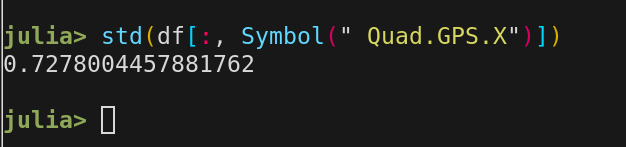
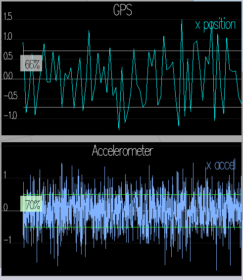
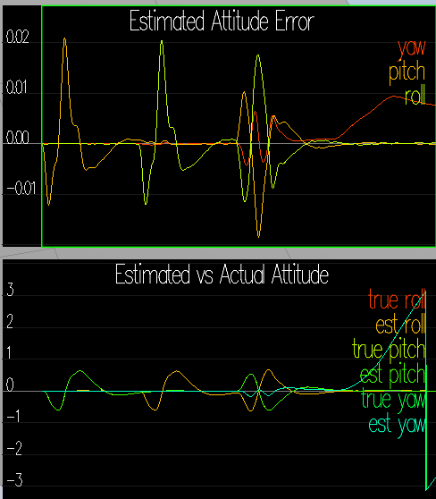
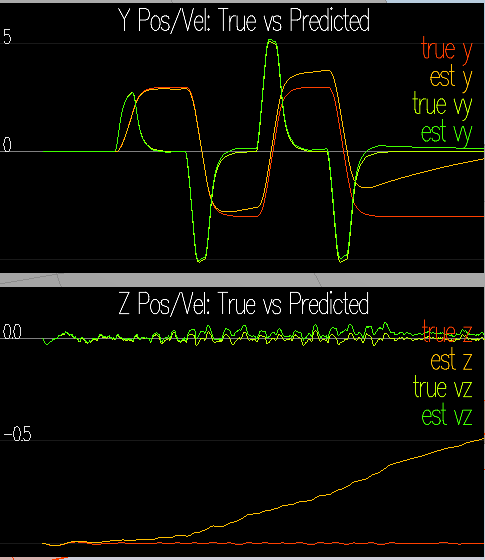
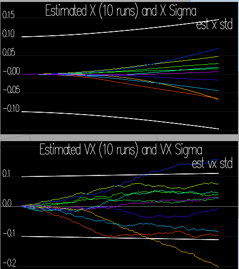
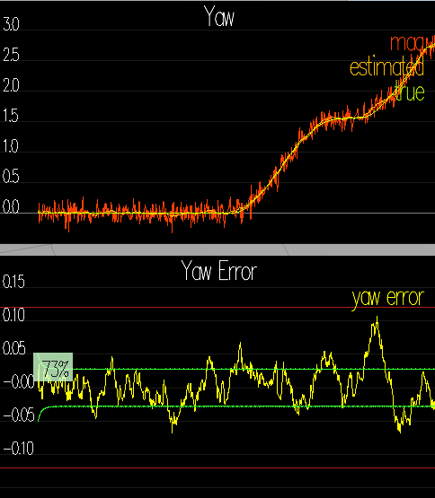

# Project: Building An Estimator

## Implement Estimator

### Determine standard deviation

I run the scenario 6 and then computed the standard deviation from the logged
data in `config/log/Graph(1,2)`. After changing the values 

```
MeasuredStdDev_GPSPosXY = 0.714
MeasuredStdDev_AccelXY = .51
```
in `config/06_SensorNoise`, 68% of the sensor measuremnets are within the
standard deviation. The computation of the standard deviations was done standard
functions from the `Statistics` package in `Julia`.



The following shows the GPS/Accelerometer graphs and the standard deviations:



### Implement better rate gyro attitude integration scheme

The relevant change in code in the function `UpdateFromIMU` is in the file `src/QuadEstimatorEKF` lines 98-103:

```
  Quaternion<float> qt = Quaternion<float>::FromEuler123_RPY(rollEst, pitchEst, ekfState(6)); 
  qt.IntegrateBodyRate(gyro, dtIMU);

  float predictedPitch = qt.Pitch();
  float predictedRoll = qt.Roll();
  ekfState(6) = qt.Yaw();	// yaw
```

This is as described in the accompanying PDF. The following shows the attitude measurements with the improved code:



### Implement EKF prediction

I implemented the EKF prediction step exactly as described in the accompanying
PDF. A bit confusing was that the `PredictState` function also gets the gyro
measurements which are in effect unused in this implementation. The updated code is in `src/QuadEstimatorEKF.cpp` lines 145-179 for `PredictState` and lines 209-261 for the full EKF prediction step `Predict`.

The fundamental prediction step for the covariance is at line 257 where we use the fixed starting covariance estimate `Q`:

```
  ekfCov = gPrime * ekfCov * gPrime.transpose() + Q; 
```

The following shows predicted vs. actual measurements for the `y/z` coordinates and velocities. 



The next figure shows the estimated vs. actual standard deviations:

 

The following figure shows the estimates vs. actual yaw:



### Implement magnetometer update

Again, the implementation follows the accompanying PDF to the word. Here is the relevant code:

```
  hPrime(6) = 1.f;
  zFromX(0) = ekfState(6);
    float diff = magYaw - ekfState(6);
    if (diff > F_PI) {
        zFromX(0) += 2.f*F_PI;
    } else if (diff < -F_PI) {
        zFromX(0) -= 2.f*F_PI;
    }
```

The function `UpdateFromMag` is in the file `src/QuadEstimatorEKF.cpp` lines 294-320. Note-worthy is the correction to make sure zFromX(0) stays within the [0,PI)
range.

### Implement GPS update

The implementation follows the accomponying PDF closely:

```
  MatrixXf hPrime(6, QUAD_EKF_NUM_STATES);
  hPrime.setZero();
  hPrime << 1.f, 0.f, 0.f, 0.f, 0.f, 0.f, 0.f,
            0.f, 1.f, 0.f, 0.f, 0.f, 0.f, 0.f,
            0.f, 0.f, 1.f, 0.f, 0.f, 0.f, 0.f,
            0.f, 0.f, 0.f, 1.f, 0.f, 0.f, 0.f,
            0.f, 0.f, 0.f, 0.f, 1.f, 0.f, 0.f,
            0.f, 0.f, 0.f, 0.f, 0.f, 1.f, 0.f;

  zFromX = hPrime * ekfState;
```

The function `UpdateFromGPS` is in `src/QuadEstimatorEKF.cpp` lines 263-292.

## Flight Evaluation

### Performance criterias

After some tweaking of the variables in `config/QuadEstimatorEKF.txt` all the
scenarios pass succesfully.

### Own controller

I tested with my own controller implementation of the previous project with
the quad control parameters found in the previous project. With this controller
the GPS update scenario passes as well (<1m deviation during box flight). There
seems to be a bug in my controller that makes the drone lift in the second
corner, the deviation of the sensors is however still below the 1m mark.

I added the files `config/QuadControlParams.txt.back` and `src/
QuadControl.cpp.back` which is my own controller for testing.
